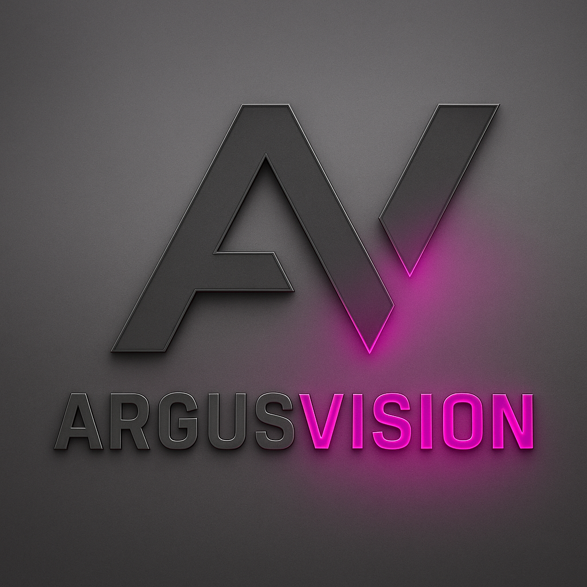

<p align="center">
  
</p>

# 🛰️ **ArgusVision — Aerial Detection & Segmentation Research Platform**
### *PhD in Photogrammetry, NTUA — Phase 1: Publication Sprint*
**Author:** Panagiotis Fragkos (LtCol, Hellenic Army)
**Supervisor:** Prof. Charalampos Ioannidis
**Program timeline:** 2025 → 2030 | **Current phase:** PhD Year 1 (Phase 0 — Master Thesis — completed July 2026, 10/10)

---

# 📘 Overview

**ArgusVision** is a multi-phase research program for aerial computer vision:

- **Aerial object detection** with YOLO (OBB representations)
- **Prompt-driven segmentation** with Meta's Segment Anything Model (SAM)
- **AerialFuseCV** — paired detection–segmentation dataset (DOTA v1.0 OBB + iSAID masks, instance-level reconciliation)
- Systematic **benchmarking** of training-free vs supervised pipelines
- Future: edge inference, dual-UAV cooperative perception, near-real-time mapping

**Phase 0 headline results** (thesis, defended 8 Jul 2026): OBB is a prerequisite for aerial detection (VBB F1 0.34% vs OBB 62.4%); prompt quality dominates SAM model size (ViT-B 66.9% vs ViT-H 67.7% IoU); integrated pipeline 67.9% mask IoU with detection recall (62.1%) as the bottleneck. Full verified numbers: `Athena_Protocols/ATHENA_STATE.md`.

---

# 🎯 Current Mission — Publication Roadmap v2.0

| # | Paper | Venue (primary) | Submit |
|---|---|---|---|
| P0 | AerialFuseCV Zenodo release (DOI) | Zenodo | Aug 2026 |
| P1 | AerialFuseCV data descriptor | ISPRS Open Journal of P&RS | Sep 2026 |
| P2 | Training-free detection→segmentation (flagship) | ISPRS Journal of P&RS | Feb 2027 |
| P3 | Condensed pipeline findings (conference) | EarthVision @ CVPR 2027 / IGARSS 2027 | Nov 2026 / Jan 2027 |
| P4 | ArgusVision full benchmark | IEEE TGRS | Sep–Oct 2027 |

Canonical plan: `ArgusVision_Strategic_Planning/PUBLICATION_ROADMAP.md` (living document, revision-controlled).

---

# 🗂️ Repository Structure

```
ArgusVision/
├── CLAUDE.md / GEMINI.md / AGENTS.md    # ATHENA bootstrap stubs (identical) — any AI agent initializes from these
├── Athena_Protocols/
│   ├── ATHENA_RISE.md                   # ATHENA v2.0 — identity, modes, protocols
│   ├── ATHENA_STATE.md                  # Program ledger — cross-environment source of truth
│   └── archive/                         # v1.3 protocols (historical)
├── ArgusVision_Strategic_Planning/      # Publication roadmap (canonical) + 5-year plan
├── ArgusVision_for_Master_Thesis/       # Phase 0 archive — frozen
├── papers/                              # WTF-P workspaces, one per paper (see papers/README.md)
├── zenodo_release/                      # P0 packaging: annotations, script, checksums, licence
├── src/                                 # Pipeline code (ArgusVision core, models, experiments, utils)
├── dataset/                             # AerialFuseCV construction & visualization scripts
├── results/                             # Experiment outputs — only *_metrics.json / summaries committed
├── documentation/                       # HOW_TO, commands
└── assets/                              # Branding, figures
```

---

# 🚀 Setup

```bash
conda env create -f ArgusVision_environment.yml
conda activate argusvision
```

Run everything from repo root (path convention), e.g.:

```bash
python src/experiments/evaluate_sam.py --output results/sam_evaluation
python src/experiments/evaluate_ArgusVision.py
```

Heavy assets (datasets, weights, checkpoints) live on the NTUA GPU machine and never enter git — locations recorded in `ATHENA_STATE.md`.

---

# 🦉 ATHENA

The project's AI layer. One identity, four modes — 🟢 STRATEGIST · 🔵 ADVISOR · 🟡 OPERATOR · 🔴 REVIEWER — defined in `Athena_Protocols/ATHENA_RISE.md`. Any supported AI CLI (Claude Code, Gemini CLI, Codex/OpenCode) auto-initializes as ATHENA via the root bootstrap stubs and restores full program state from `ATHENA_STATE.md`.

**Session ritual:** `git pull` → ATHENA announces state → work → update `ATHENA_STATE.md` on milestones → commit to `dev` → push. `ArgusVision_main` receives milestone merges only.

---

# 🏁 Phases

| Phase | Scope | Status |
|---|---|---|
| 0 — Master Thesis | Minimal controlled YOLO→SAM evaluation, AerialFuseCV, thesis | ✅ Complete (Jul 2026, 10/10) |
| 1 — PhD Years 1–2 | Publication sprint P0–P4, P2/P4 experiment blocks | 🟢 **Active** |
| 2 — PhD Years 2–5 | Edge Engine → dual-UAV cooperative perception → real-time mapping → v3.0 demonstrator | 🔒 Held until Phase 1 on track |

---

*Updated: 28 Jul 2026 — Maintained by ATHENA (v2.0)*
